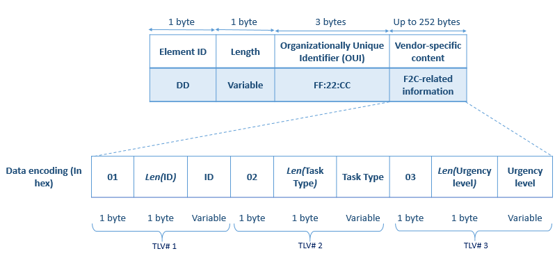
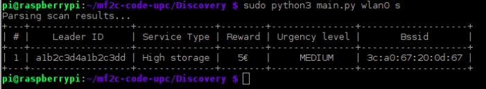
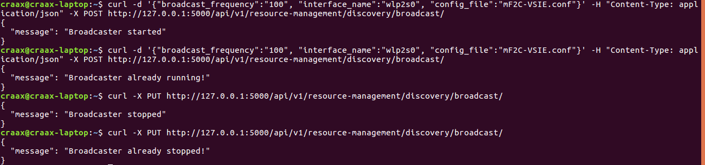
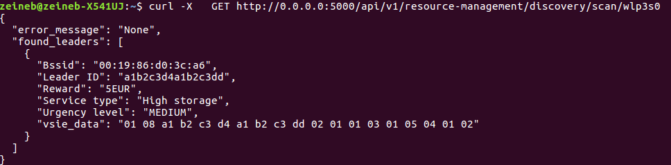
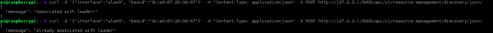
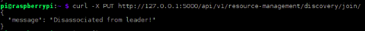

# mF2C Discovery
The Discovery module is part of the Resource Management block in the Agent Controller. Its main role is to allow devices taking part in the mF2C system to become aware of each other. To this end, mF2C information is advertized within 802.11 beacons (more specifically within the Vendor-Specific Information Element (VSIE) field). These beacons are then sent by a leader in order to make itself discoverable by other agents.  

This repository contains the following files:
* **main.py**: the main Python script that an agent should run in order to send mF2C beacons or to detect those beacons or to associate with a leader after receiving a beacon
* **Broadcaster.py** : A class representing broadcast-related functions
* **Watcher.py**: A class with functions to start/stop watching events of agents joining/leaving
* **Scanner.py** : A class representing scan-related functions
* **JoinConfig.py**: A class representing configuration required to associate with a leader
* **Vsie.py** : A class representing a vendor-specific information element
* **InformationElementAttribute.py** : A class representing an attribute to be included within a vendor-specific information element
* **mF2C-VSIE.conf**: A sample configuration file allowing the configruation of the content of the mF2C VSIE.
* **onHostapdChange.sh**: Helper script for Watcher.py
* **app.py**: To start the Flask app for the API-based execution
* **Dockerfile**: Used to build the docker image

## Some theory...

As previously stated, we propose to embed mF2C-related information within 802.11 beacons which are sent by leaders as advertisements allowing agents to become aware of the existence of leaders in their vicinity. The IEEE 802.11 standard specifies the Vendor-Specific Information Element field in the beacon frame in order to carry customized information. Therefore, we use this option to advertize mF2C-related information.

As it can be seen in the figure below, the first byte of the IE represents the IE ID, which should be 221. It is followed by one byte to represent the length of the subsequent fields. Then, the Organizationally Unique Identifier is included (3 bytes, in this case FF:22:CC). Finally comes the actual vendor specific content, where up to 252 bytes of information can be carried. We represent this information as a list of consecutive TLVs (Type-Length-Value). Within a TLV, the first byte represents the type of the attribute being advertized (an example list is presented below), the second byte represents the length in bytes of the attribute's value, which is the last part of the TLV. 



The table below shows a tentative list of attributes we could advertize within the mF2C beacon along with their corresponding TLV characteristics:

| Type | Meaning       |Length           | Value                                                                                                                                                        |
| ---- |:--------------|:----------------|:-------------------------------------------------------------------------------------------------------------------------------------------------------------|
| 01   | Leader ID     | Length of the ID| To be retrieved from the Identification Module                                                                                                               |
| 02   | Service Type  | One byte        | There should be codes for different service types, for instance, 01 would mean a Virtual Reality service, 02 would mean a Smart healthcare service, etc... |
| 03   | Reward        | One byte        | Monetary reward or social reward, to be determined                                                                                                           |
| 04   | Urgency level | One byte        | Tentatively, 01 would mean "high urgency", 02 "medium urgency" "03" low urgency                                                                              |

The way information is encoded/decoded in the provided code is done based on the examples in this table.

## Getting Started (Non-containerized version)

This section will provide you with the list of prerequisites and the steps needed to get the code running.

### Prerequisites

For both the leader and the agent:

* Linux operating system, Debian-based distribution
* Python 3
* Flask, lightweight Python-based web server, installed as follows:

```
sudo pip3 install flask
```
* netifaces Python library, here used for interface-related checks, installed as follows:
```
sudo pip3 install netifaces
```
For the leader side: 

* A device with a wireless card that supports "master mode" (i.e. that can act as an access point). You can check whether your card supports master mode by running the following command, looking for the "Supported interface modes". You should find "AP" in the list (i.e. Master mode) :

```
sudo iw list
```

* [hotsapd](https://wireless.wiki.kernel.org/en/users/documentation/hostapd) - The Linux Access Point Implementation, in our case used to send beacons with the preconfigured mF2C VSIE. Could be installed as follows:

```
sudo apt-get install hostapd
```
In order to be able to use the wireless interface to broadcast beacons, you need to prevent NetworkManager from managing it. To do so, add the following line to /etc/NetowrkManager/NetworkManager.conf: 
```
[keyfile]
unmanaged-devices=mac:aa:bb:cc:dd:ee:ff
```
where aa:bb:cc:dd:ee:ff is the MAC address of the wireless device you will be using. Then restart NetworkManager. 

For the agent side: 

* [iw](https://wireless.wiki.kernel.org/en/users/documentation/iw) - Linux wireless configuration utility, in our case used within the Python script to perform a wireless scan and return the corresponding results.
* PrettyTable module for a user-friendly display of scan results. Installed as follows:

```
sudo apt-get install python3-prettytable
```

* [wpa_supplicant](https://wiki.archlinux.org/index.php/WPA_supplicant) - Could be installed as follows:

```
sudo apt-get install wpasupplicant
```
### Running

The discovery module could be run in three ways, depending on the underlying function to be used, i.e. broadcaster or scanner or join. The general format would be the following:

```
sudo python3 main.py wireless_interface function (beacon_interval/bssid) (config_file)
```

where:

- wireless_interface is the name of the WiFi device, e.g. wlan0
- function, either b for broadcasting or s for scanning or j for joining/associating with a leader
- beacon_interval only if function chosen previously was "b"
- bssid only if function chosen previously was "j"
- config_file also only if function chosen was "b"

Note that the program should run with root privileges, as required by the underlying hostapd and iw tools.

Then,

* In order to start broadcasting mF2C beacons, the following command should be typed:

```
sudo python3 main.py wireless_interface b beacon_interval config_file
```

**Note that if hostapd is already running, it should be stopped first using "sudo service hostapd stop"**

Running the previous command will trigger the following actions:

1. The fill_beacon_fields method (from the Broadcaster class) will fill the necessary fields in the hostapd.conf file. It takes the beacon_interval,the interface name and the mF2C VSIE configuration file as parameters
2. Within this function, the mF2C VSIE will be created as an instance of the Vsie class, using attributes created using the InformationElementAttribute class. 
3. The create_mf2c_vsie_hex method in the Vsie class will be in charge of the proper encoding the mF2C information, to be compliant with the format that hostapd expects.
4. Then, the start_broadcast method will actually start broadcasting the beacons (hostapd will start behind the scenes)

Note 1: The beacon_interval should be between 15 and 65535, as this is the range that hostapd accepts. (The default interval being 100ms)

Note 2: While filling the beacon fields, ignore_broadcast_ssid is set to 1 in order to send empty (length=0) SSID in the beacon, otherwise the SSID will be sent and the leader will appear as an access point in any Wi-Fi client application (which should be avoided in our case). 


* In order to perform a scan for mF2C beacons, the following command should be typed:

```
sudo python3 main.py wireless_interface s
```
This will trigger the following actions:

1. A wireless scan will start using the interface that the user typed ("iw" command is used behind the scenes)
2. The parse_scan_results() method of the Scanner class will go through the scan results and if the mF2C OUI has been found within a vendor-specific information element (VSIE), it will create a "leader_dict" dictionary to store the leader's information. In fact, the get_vendor_specific_content (pertaining to the Vsie class) will be called to retrieve the list of attributes advertized in the VSIE. 
3. For each attribute, the get_attribute_dict will be called to retieve a dictionary of decoded attribute information. 
4. The leader_dict will be added to the list of found leaders to be returned to the user.

The following screenshot illustrates the expected output :



* In order to associate with a leader, the following command should be typed:

```
sudo python3 main.py wireless_interface j bssid
```
For example:
```
sudo python3 main.py wlan0 j aa:bb:cc:dd:ee:ff
```
**Note that if wpa_supplicant is already running, it should be stopped first using "sudo wpa_cli terminate"**

This will trigger the following actions:

1. The configuration file of wpa_supplicant will be filled. Note the use of "scan_ssid=1" since we are dealing with a hidden SSID. For the same reason, instead of an association using the SSID, we use the BSSID field (retrieved from the scan results in the previous step).
2. wpa_supplicant is started.(No internet access is given to the agent)

### Discovery API

**To start the flask app run:**
```
sudo python3 app.py
```

**To start broadcasting run:**
```
curl -d '{"broadcast_frequency":"100", "interface_name":"your_interface_name", "config_file":"mF2C-VSIE.conf"}' -H "Content-Type: application/json" -X POST http://0.0.0.0:5000/api/v1/resource-management/discovery/broadcast/
```
**Note that if hostapd is already running, it should be stopped first using "sudo service hostapd stop"**

**To stop broadcasting run:**
```
curl -X PUT http://0.0.0.0:5000/api/v1/resource-management/discovery/broadcast/
```
The example output below shows the corresponding screenshots. It also shows that the correct messages are displayed whenever the broadcaster is started or stopped twice consecutively.



**To scan for mF2C beacons run:**
```
curl -X   GET http://0.0.0.0:5000/api/v1/resource-management/discovery/scan/your_interface_name
```
Example output below:



**To associate with a leader after receiving an mF2C beacon run:**
```
curl -d '{"interface":"your_interface_name", "bssid":"aa:bb:cc:dd:ee:ff"}' -H "Content-Type: application/json" -X POST http://0.0.0.0:5000/api/v1/resource-management/discovery/join/
```
Example output below:



You can double-check the status of the association either by running "iwconfig" or "wpa_cli status".

**To disassociate from leader run:**
```
curl -X PUT http://0.0.0.0:5000/api/v1/resource-management/discovery/join/
```
Example output below:



**To start watching for agents joining/departure events run:**
```
curl -X GET http://0.0.0.0:5000/api/v1/resource-management/discovery/watch/
```

**To stop watching for agents joining/departure events run:**
```
curl -X PUT http://0.0.0.0:5000/api/v1/resource-management/discovery/watch/
```

## Running using Docker (Same backend logic as above)

### Prerequisites

If you are using a Linux distribution using NetworkManager for default network configuration, the following steps may be needed to prevent it from controlling the discovery interface.

- Option 1: Add the following line to /etc/NetworkManager/NetworkManager.conf: 
```
[keyfile]
unmanaged-devices=mac:aa:bb:cc:dd:ee:ff
```
where aa:bb:cc:dd:ee:ff is the MAC address of the wireless device you will be using. Then restart NetworkManager. 

- Option 2: Add the following line to /etc/NetworkManager/NetworkManager.conf: 

```
[keyfile]
unmanaged-devices=interface-name:wlan0 
```
where wlan0 is the name of your wireless device you will be using. Then restart NetworkManager. 

- Option 3: Stop NetworkManager.

The above-steps are relevant for both the agent and the leader sides.

In addition, in the leader side, comment the following line, if you have it in NetworkManager.conf<sup>*</sup>  to allow dnsmasq to be started properly from the discovery component.

```
dns=dnsmasq
```

<sup>*</sup> It is likely the case if using Ubuntu 16.04.
### Bulding the image

Clone the repo. Within the repo, run the following command to build the image:

```
sudo docker build -t discovery-im .
```
To run the container using the image you just built, run:

```
sudo docker run -it --rm --net=bridge --cap-add=NET_ADMIN -p 5000:5000 --name discovery discovery-im
```
As it can be noted, the --cap-add=NET_ADMIN is used, since we need network admin capabilities to access the wireless interface of the host machine.

Then, we also need to associate the physical wireless interface to the newly created container. The script with the content below automates this process (where phy0 should be replaced with the physical interface of the wireless device you are using): 

```
#!/bin/bash
DOCKER_NAME="discovery"
PHY=phy0
pid=$(docker inspect -f '{{.State.Pid}}' $DOCKER_NAME)
# Assign phy wireless interface to the container 
mkdir -p /var/run/netns
ln -s /proc/"$pid"/ns/net /var/run/netns/"$pid"
iw phy "$PHY" set netns "$pid"
```

Within the container, bring the wireless interface up:
```
ifconfig interface_name up
```
Finally, also within the container, start the Flask app as follows:

```
python3 app.py
```
The same API calls above apply here.

## Tested usage scenarios

The table below presents the different combinations used for testing the discovery module functionalities:

| Device   | OS          | Wireless card vendor  | Scanner function | Broadcaster function |
| -------- |:-----------:| :--------------------:|:----------------:| :-------------------:|
|Laptop    |Ubuntu 16.04 | Atheros (Built-in)    |OK                |OK                    |
|Laptop    |Ubuntu 16.04 | Intel (Built-in)      |OK                |OK                    |
|Raspberry |Raspbian     | Broadcom (Built-in)   |OK                |NOT OK                |
|Raspberry |Raspbian     | Ralink (USB)          |OK                |OK                    |

## Authors

* **Zeineb Rejiba** - *Initial work* - zeinebr@ac.upc.edu

See also the list of [contributors](https://gitlab.com/mf2c-upc/mf2c-code-upc/graphs/master) who participated in this project.

## License

## Credits

* [Container access to wireless network interface](https://github.com/fgg89/docker-ap/wiki/Container-access-to-wireless-network-interface)
* [Using Hostapd with dnsmasq to create Virtual Wifi Access Point in Linux](https://nims11.wordpress.com/2013/05/22/using-hostapd-with-dnsmasq-to-create-virtual-wifi-access-point-in-linux/)

## More

More information can be found in the following deliverables: 

* D3.3 "Design of the mF2C Controller Block" (http://www.mf2c-project.eu/wp-content/uploads/2017/09/D3.3-final.pdf) 
* D3.5 "mF2C Agent Controller block integration" (http://www.mf2c-project.eu/wp-content/uploads/2017/12/D3.5-mF2C-Agent-Controller-Block-integration-IT-1.pdf)
* D4.7 "mF2C-Interfaces-IT-1" http://www.mf2c-project.eu/wp-content/uploads/2017/12/D4.7-mF2C-Interfaces-IT-1.pdf)